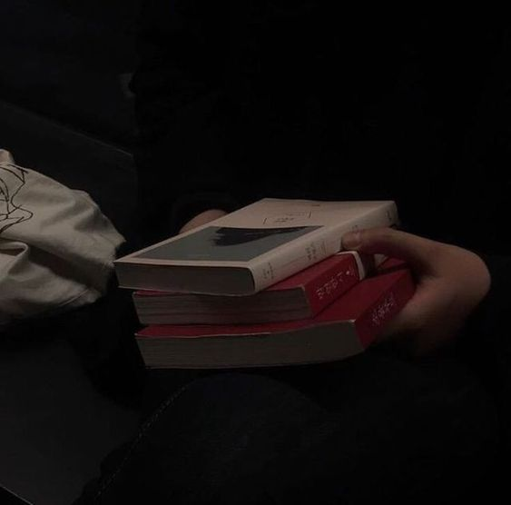

<!-- PROJECT LOGO -->
<div align="center">
  <a href="https://github.com/Zer0Power/Majestic-Api">
    
  </a>

  <h3 align="center">Majestic Api Docs</h3>

  <p align="center">
    Request Body And Headers Documents
    <br />
    <a href="https://github.com/Zer0Power/Majestic-Api"><strong>Explore the docs »</strong></a>
    <br />
    <br />
    <a href="https://github.com/Zer0Power/Majestic-Api">View Demo</a>
    ·
    <a href="https://github.com/Zer0Power/Majestic-Api/issues">Report Bug</a>
    ·
    <a href="https://github.com/Zer0Power/Majestic-Api/blob/main/end-points.md">End Points</a>
  </p>
</div>

# MaxGaming EndPoints

## Faceit Api

### player route

Request :

```JS
Method = GET
Path = /maxgaming/faceit/player?id=76561198888359740
PARAMS = id => Steamid64
```

Response:

```JSON
{
    "status":200,
    "data": {
        "player_id": "df24694e-12bf-4725-8b43-e1ed2f4a0d94",
        "nickname": "Zer0P0wer",
        "avatar": "https://distribution.faceit-cdn.net/images/8eb97d12-010d-4ab4-ae69-7c3913e5109c.jpeg",
        "country": "jp",
        "cover_image": "https://distribution.faceit-cdn.net/images/1c6f1925-821d-437e-864f-fb0aeef9cc20.jpeg",
        "platforms": {
            "steam": "STEAM_0:0:464047006"
        },
        "games": {
            "csgo": {
                "region": "EU",
                "game_player_id": "76561198888359740",
                "skill_level": 5,
                "faceit_elo": 1299,
                "game_player_name": "'Zer0Power",
                "skill_level_label": "",
                "regions": {},
                "game_profile_id": ""
            }
        },
        "settings": {
            "language": "en"
        },
        "friends_ids": [
            "e23e0e55-7778-421d-ab71-b70a8709246d",
            "eddf15e9-42b9-4af5-b3c7-8574a42e6fc3",
            "93ab81a4-cfdd-45e0-8d9f-c21ab0b4234c"
        ],
        "new_steam_id": "[U:1:928094012]",
        "steam_id_64": "76561198888359740",
        "steam_nickname": "ᶻᵉʳᵒ༄ᴩᴏᴡᴇʀ💔",
        "memberships": [
            "free"
        ],
        "faceit_url": "https://www.faceit.com/{lang}/players/Zer0P0wer",
        "membership_type": "",
        "cover_featured_image": "",
        "infractions": {}
    }
}

```

### hub route

Request:

```JS
Method = GET
Path = /maxgaming/faceit/hub?id=76561198888359740
PARAMS = id => Steamid64
```

Response:

```JSON
{
    "status":200,
    "hubs": "[{\"hub_id\":\"998b6d53-57ab-4f8e-988c-319a72b1b557\",\"name\":\"MaxGaming CSGO Community\",\"avatar\":\"https://assets.faceit-cdn.net/hubs/avatar/998b6d53-57ab-4f8e-988c-319a72b1b557_1654293267622.jpg\",\"game_id\":\"csgo\",\"organizer_id\":\"9144d203-1505-4420-97a4-1073cb7917b4\",\"faceit_url\":\"https://www.faceit.com/{lang}/hub/998b6d53-57ab-4f8e-988c-319a72b1b557/\"},{\"hub_id\":\"2920d286-a408-4cf7-8241-82516185b99e\",\"name\":\"Pimp's Clan\",\"avatar\":\"https://assets.faceit-cdn.net/hubs/avatar/2920d286-a408-4cf7-8241-82516185b99e_1675250845022.jpg\",\"game_id\":\"csgo\",\"organizer_id\":\"3cd10168-6f35-4619-a058-c4270c49de8a\",\"faceit_url\":\"https://www.faceit.com/{lang}/hub/2920d286-a408-4cf7-8241-82516185b99e/\"},{\"hub_id\":\"48cc3d2f-5234-4d0b-be9b-76585efed243\",\"name\":\"OHNEPIXEL'S CLAN\",\"avatar\":\"https://assets.faceit-cdn.net/hubs/avatar/48cc3d2f-5234-4d0b-be9b-76585efed243_1652952377892.png\",\"game_id\":\"csgo\",\"organizer_id\":\"71cc5e44-0020-42ad-822c-a456cf5b8a89\",\"faceit_url\":\"https://www.faceit.com/{lang}/hub/48cc3d2f-5234-4d0b-be9b-76585efed243/\"},{\"hub_id\":\"865ab3a5-923c-467a-a479-00434446a0a0\",\"name\":\"Axis Hub\",\"avatar\":\"https://assets.faceit-cdn.net/hubs/avatar/865ab3a5-923c-467a-a479-00434446a0a0_1604661075981.jpg\",\"game_id\":\"csgo\",\"organizer_id\":\"aebd3a1f-5d26-4c74-b317-63241d13f532\",\"faceit_url\":\"https://www.faceit.com/{lang}/hub/865ab3a5-923c-467a-a479-00434446a0a0/\"},{\"hub_id\":\"ae624a2c-7844-4529-8fc6-18b87c0f8a2f\",\"name\":\"BlackrocksPro CLAN\",\"avatar\":\"https://assets.faceit-cdn.net/hubs/avatar/ae624a2c-7844-4529-8fc6-18b87c0f8a2f_1628986839201.jpg\",\"game_id\":\"csgo\",\"organizer_id\":\"936ca97f-a0c7-4e4d-aca0-d4aea9025a6c\",\"faceit_url\":\"https://www.faceit.com/{lang}/hub/ae624a2c-7844-4529-8fc6-18b87c0f8a2f/\"},{\"hub_id\":\"d54ea84a-8f3c-4692-9f88-504d3f0c6d5e\",\"name\":\"CS:GO Middle East 1v1\",\"avatar\":\"https://assets.faceit-cdn.net/hubs/avatar/d54ea84a-8f3c-4692-9f88-504d3f0c6d5e_1560456699218.jpg\",\"game_id\":\"csgo\",\"organizer_id\":\"c3d1125a-3a70-4fe9-8545-269dd8873208\",\"faceit_url\":\"https://www.faceit.com/{lang}/hub/d54ea84a-8f3c-4692-9f88-504d3f0c6d5e/\"},{\"hub_id\":\"f2ff4bac-8462-4ac6-b32a-8234ce7bda49\",\"name\":\"UNLUKO\",\"avatar\":\"https://assets.faceit-cdn.net/hubs/avatar/f2ff4bac-8462-4ac6-b32a-8234ce7bda49_1652881130241.jpg\",\"game_id\":\"csgo\",\"organizer_id\":\"e42779d1-5419-407a-ad16-e94c8f4fc637\",\"faceit_url\":\"https://www.faceit.com/{lang}/hub/f2ff4bac-8462-4ac6-b32a-8234ce7bda49/\"}]"
}
```

### faceitid route

Request:

```JS
Method = GET
Path = /maxgaming/faceit/faceitid?id=76561198888359740
PARAMS = id => Steamid64
```

Response:

```JSON
{
    "status": 200,
    "faceitID": "df24694e-12bf-4725-8b43-e1ed2f4a0d94"
}
```

## Server Data

### servers router

Request:

```JS
Method = GET
Path = /maxgaming/serverdata/servers
```

Response:

```JSON
{
    "totalServers": 58,
    "vps1Onlines": 29,
    "vps2Onlines": 29,
    "totalPlayers": 92,
    "vps1Players": 46,
    "vps2Players": 46,
    "vps1Servers": [
        {
            "port": 29389,
            "name": "BARCODE Public Server",
            "players": 0
        }
    ],
    "vps2Servers": [
        {
            "port": 29674,
            "name": "Pilakoot MixMatch+ |Warmup: Retakes|",
            "players": 0
        }
    ]
}
```

### ports router

Request:

```JS
Method = GET
Path = /maxgaming/serverdata/ports
```

Response:

```JSON
{
    "vps1Ports": [
        29760,
        27015,
        29786,
        29775,
        29756,
        29210,
        27019
    ],
    "vps2Ports": [
        29395,
        28235,
        27018,
        29674,
        29613,
        27020,
        29696
    ]
}
```

### counts route

Request:

```JS
Method = GET
Path = /maxgaming/serverdata/counts
```

Response:

```JSON
{
    "totalServers": 59,
    "vps1Onlines": 30,
    "vps2Onlines": 29,
    "totalPlayers": 147,
    "vps1Players": 83,
    "vps2Players": 64
}
```

### getData routes

Request :

```JS
Method = GET
Path = /maxgaming/serverdata/getData?ip=85.114.146.38&port=27015
PARAMS = ip => GameServer IP , port => GameServer Port
```

Response:

```JSON
{
    "addr": "85.114.146.38:27015",
    "gameport": 27015,
    "specport": 27016,
    "steamid": "85568392922521934",
    "name": "FACEIT.com register to play here",
    "appid": 730,
    "gamedir": "csgo",
    "version": "1.38.5.2",
    "product": "csgo",
    "region": 255,
    "players": 10,
    "max_players": 16,
    "bots": 1,
    "map": "de_mirage",
    "secure": true,
    "dedicated": true,
    "os": "l",
    "gametype": "secure"
}
```

## Rcon

### command

Request :

```JS
METHOD = POST
Path = /maxgaming/rcon/command
Header = authorization <API TOKEN>
```

Request Body :

```JSON
{
    "sv":"185.141.133.16",
    "cmd":"sm_admin_list",
    "port":"27015",
    "pass":"WhyImSoGOOD@GoodVibes"
}
```

Response :

```JSON
{
    "status": 200,
    "server": "185.141.133.16",
    "port": "27015",
    "cmd": "sm_admin_list",
    "response": "\"a\"\n\"Atlas\" \"Staff\" \"1317408\" \"a\"\n\"donjw\" \"Lord\" \"1317420\" \"a\"\n\"spawn\" \"Major\" \"1317432\" \"a\"\n\"Medusa\" \"Intern\" \"1317444\" \"a\"\n\"ali\" \"Colonel\" \"1317456\" \"a\"\n\"lunixius\" \"Intern\" \"1317464\" \"a\"\n\"vine\" \"Intern\" \"1317476\" \"a\"\n\"junior\" \"Lord\" \"1317484\" \"a\""
}
```

# Embed EndPoints

## send route

Request :

```JS
Method = POST
Path = /embed/send
```

Request Body :

```JSON
{
    "tkn": "Discord Bot Token", //String : MTAKSHvkfjlfdb4MDcwOTY0MDMyMw.GmzXzD.OlajdhjkgfsSKm5p_UXK645dfs144jYaM-7Q74Jy4
    "channelid": "Discord ChannelID", //Numeric : 985960571428028416
    "title": "Title", //String : test
    "url": "Url", //String (Must Have https or http) : http://0powerdev.ir
    "description": "Description", //String : Jack Is A Good Dog :D
    "thumbnail": "Thumbnail Image Link", //String (Must Have https or http) : https://cdn.discordapp.com/attachments/985960571428028416/1042155910367285299/360_F_250195930_tnw6UtbNOnGeBOX3OriqImfknthDJgc2.jpg
    "image": "Image Link", //String (Must Have https or http) : https://cdn.discordapp.com/attachments/985960571428028416/1042155910115643432/360_F_117351782_ugRMzKUg8pz8ucKVqIPI1JzQSCItC0Hx.jpg
    "footer": "Footer", //String : 0Power
    "footerUrl": "Footer Url", //String (Footer Profile)(Must Have https or http) : https://cdn.discordapp.com/attachments/985960571428028416/1042155910115643432/360_F_117351782_ugRMzKUg8pz8ucKVqIPI1JzQSCItC0Hx.jpg
    "color": "Color Code With #", //Hex : #000
    "role": "Role" //String : none , everyone , here , 798517489750507570
}
```

Response :

```JSON
{
    "status": 200,
    "message": "server sent the embed request as expected"
}
```
